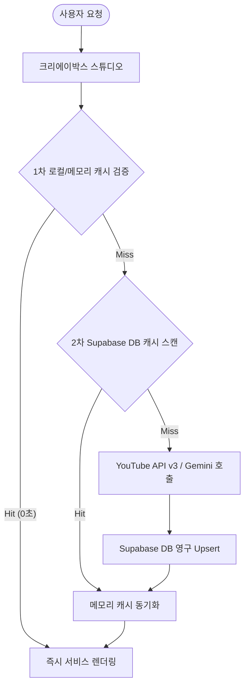

# 유튜브 공식 API v3 응용 및 크리에이박스(CreAibox) AI 연동 가이드라인

본 문서는 YouTube Data API v3의 다양한 명세를 분석하고, 이를 크리에이박스(CreAibox)의 고성능 Gemini AI 엔진과 융합하여 크리에이터 전용 분석 도구를 빌드할 수 있는 아키텍처 및 기능별 응용 방안을 수록합니다.

---

## 1. 개요 (Introduction)
유튜브 크리에이터 시장이 급성장함에 따라, 단순한 비디오 시청 통계 제공을 넘어 **"인기 영상의 흥행 메커니즘을 역설계(Reverse Engineering)"**하고 이를 **"내 채널용 remix 기획안으로 재창조"**하는 능력이 플랫폼의 경쟁력입니다.
YouTube Data API v3에서 제공하는 메타데이터와 시청자 댓글 여론을 Gemini AI 모델에 주입하여, 크리에이박스를 차세대 **"AI 유튜브 전략 분석 스튜디오"**로 도약시키는 로드맵을 기술합니다.

---

## 2. 유튜브 API v3 핵심 리소스 및 작동 원리

YouTube API v3는 리소스별로 역할을 분담하며, 각 요청 시 할당량(Quota, 1일 기본 10,000포인트)을 소비합니다. 쿼터를 극대화하기 위해 효율적인 호출 방식을 취해야 합니다.

### 2.1 Search 리소스 (search.list)
* **역할**: 키워드, 채널 ID, 업로드 날짜, 정렬 기준(조회수순, 관련도순)에 부합하는 동영상, 채널, 재생목록 목록을 검색합니다.
* **소모 Quota**: **100 포인트** (가장 소모량이 큼)
* **작동 원리**: `q` 파라미터에 검색어를 던져 상위 비디오 ID 목록을 도출합니다.

### 2.2 Videos 리소스 (videos.list)
* **역할**: 특정 동영상 ID(들)에 대해 상세 설명, 태그, 재생 시간(Duration), 조회수, 좋아요수, 댓글수, 해상도 등 모든 물리적 메타데이터를 전수 조사합니다.
* **소모 Quota**: **1 포인트** (일괄 조회 가능, 최대 50개 ID 묶음)
* **작동 원리**: `id` 파라미터에 비디오 ID를 쉼표로 연결해 1회 호출로 다량의 통계를 캐싱합니다.

### 2.3 CommentThreads 리소스 (commentThreads.list)
* **역할**: 특정 동영상에 달린 시청자들의 1차 댓글 목록과 작성자 정보, 좋아요수, 답글수 정보를 수집합니다.
* **소모 Quota**: **1 포인트**
* **작동 원리**: `videoId` 및 정렬 조건(`order=relevance` 혹은 `time`)을 지정하여 해당 영상의 가장 활성화된 최신 여론 데이터를 JSON 배열로 수령합니다.

### 2.4 Channels 리소스 (channels.list)
* **역할**: 특정 유튜브 채널의 누적 조회수, 구독자 수, 동영상 개수, 프로필 정보, 그리고 채널이 소유한 **"전체 업로드 영상 재생목록 ID (Uploads Playlist ID)"**를 수집합니다.
* **소모 Quota**: **1 포인트**
* **작동 원리**: 채널 ID를 던져 `contentDetails.relatedPlaylists.uploads` 값을 읽어와 해당 채널의 전수 비디오 로딩 교두보를 마련합니다.

---

## 3. 크리에이박스(CreAibox) AI 연동 고도화 시나리오

### 3.1 글로벌 다국가 트렌드 다각화 (Multi-Region Scraper)
* **개념**: 국내 트렌드에 한정되지 않고 미국, 일본, 베트남 등 글로벌 타겟 국가의 실시간 급상승 트렌드를 다각도로 수집하여 트렌드를 분석합니다.
* **작동 원리**:
  1. `videos.list` 호출 시 `regionCode` 매개변수에 ISO 3166-1 국가 코드(`KR`, `US`, `JP`, `VN` 등)를 주입합니다.
  2. 수집된 다국가 원천 통계를 Supabase `youtube_trending_archive`에 `region_code` 구분 키와 함께 캐싱하여 쿼터를 보존합니다.
* **CreAibox 활용 방안**: 
  - 해외 시장에 진출하려는 크리에이터들을 위해 "미국 🇺🇸 / 일본 🇯🇵 급상승 차트 기획 스튜디오" 탭을 신설합니다.
  - 글로벌 메가 히트 비디오의 흥행 요인을 분석하여 "한글화 로컬라이징 Remix 기획안"을 생성해 줍니다.

### 3.2 시청자 리얼 댓글 여론 및 피드백 분석기 (Gemini Comment Intelligence)
* **개념**: 영상의 조회수 분석을 넘어, 수백 개의 실제 댓글 데이터를 융합 분석하여 시청자가 진짜로 몰입한 지점과 불만을 파악합니다.
* **작동 원리**:
  1. `commentThreads.list`로 타겟 영상의 베스트 댓글 100~200개를 일괄 수집합니다.
  2. 수집한 댓글 텍스트 묶음을 Gemini Pro API의 프롬프트 컨텍스트에 주입합니다.
* **CreAibox 활용 방안**:
  - **시청자 흥행 코드**: 시청자가 어떤 드립이나 장면에 열광했는지 타임라인별 요약 보고서를 작성합니다.
  - **콘텐츠 이탈/위험 요소 진단**: 비판적이거나 부정적 댓글의 빈도와 맥락을 짚어 피해야 할 요소를 알려줍니다.
  - **후속 콘텐츠 기획안 발굴**: "다음 편에 해달라", "A랑 B도 비교해달라" 같은 댓글 속 시청자 니즈를 취합하여 **자동 후속 콘티 기획안**을 Gemini가 설계해 줍니다.

### 3.3 라이벌 채널 "숨은 꿀 영상" 추출 및 분석기 (Reverse Engineering Scanner)
* **개념**: 라이벌 채널의 수많은 비디오 중, 순수 구독자 규모 대비 유독 알고리즘의 선택을 받아 조회수가 비정상적으로 터진 **"숨겨진 고효율 영상"**을 선별하여 흥행 공식을 추출합니다.
* **작동 원리**:
  1. `channels.list` 로 라이벌 채널을 검색해 구독자 수를 확인하고, Uploads Playlist ID를 획득합니다.
  2. `playlistItems.list` 및 `videos.list` 로 해당 채널의 최신 50개 동영상 조회수 통계를 읽어옵니다.
  3. `[조회수 / 구독자 수]` 비율이 200%를 초과하는 "아웃라이어 영상"을 수학적으로 판독합니다.
* **CreAibox 활용 방안**:
  - 판독된 고효율 영상의 제목, 태그, 설명을 Gemini Pro에 전달하여 "알고리즘 저격용 썸네일 콘셉트 및 변형 대본 초안"을 즉시 추출해 주는 기능으로 포팅합니다.

### 3.4 실시간 키워드 검색 및 알고리즘 태그 분석기 (Keyword Tag Analysis)
* **개념**: 크리에이터가 진입하려는 키워드(예: "캠핑 브이로그")를 검색했을 때, 상위 랭킹 영상들의 태그 구성과 영상 속성을 분석하여 SEO 전략을 제안합니다.
* **작동 원리**:
  1. `search.list` 를 통해 해당 검색어로 상위 20개 비디오 목록을 로드합니다.
  2. `videos.list` 로 각 비디오의 태그(`tags` 배열)와 영상 길이(Duration)를 수집합니다.
* **CreAibox 활용 방안**:
  - **알고리즘 교집합 태그 구름**: 20개 영상에서 공통으로 가장 많이 사용된 태그 순위를 집계하여 크리에이터가 필수적으로 기입해야 할 해시태그 목록을 제안합니다.
  - **최적의 분량 가이드라인**: 상위 영상들의 평균 및 중간 재생 분량을 계산하여, "알고리즘이 선호하는 분량은 12분 30초 내외입니다"와 같은 정밀 분량 가이드를 산출합니다.

---

## 4. 캐싱 및 리소스 최적화 아키텍처 (Architecture)

유튜브 API의 10,000 Quota 제한을 방어하고, 인공지능 토큰 요금을 절약하기 위해 크리에이박스에 정립된 2중 캐싱 아키텍처를 확대 적용합니다.

* **메모리 / 로컬 캐시 (Memory Cache)**: 사용자가 브라우저에서 동일 비디오를 반복 토글할 때 불필요한 네트워크 지연이 발생하지 않도록 객체 레벨에서 1차 우회 가드를 작동시킵니다.
* **데이터베이스 캐시 (Supabase DB Cache)**: 1일 단위 수집 주기(매일 오전 05시 Cron)에 맞추어 `youtube_trending_archive` 및 `youtube_video_analysis` 테이블을 2차 조회 교두보로 삼아 API 중복 쿼터 낭비와 Gemini AI 중복 지출을 원천 방어합니다.

---

## 5. 결론 및 향후 개발 로드맵
본 가이드에 기술된 유튜브 API의 다차원 리소스와 Gemini AI의 컨텍스트 해독 능력을 융합함으로써, 크리에이박스는 크리에이터의 감에 의존하는 제작 방식을 탈피하여 **"데이터와 인공지능이 완벽히 검증한 흥행 기획"**을 단 몇 초 만에 조달하는 고차원 솔루션으로 공고히 자리 잡을 것입니다.
포팅 우선순위는 **1) 글로벌 다국가 트렌드 다각화(Region 필터), 2) 시청자 리얼 댓글 여론 분석기** 순으로 기획을 확장해 가는 것을 권장합니다.
