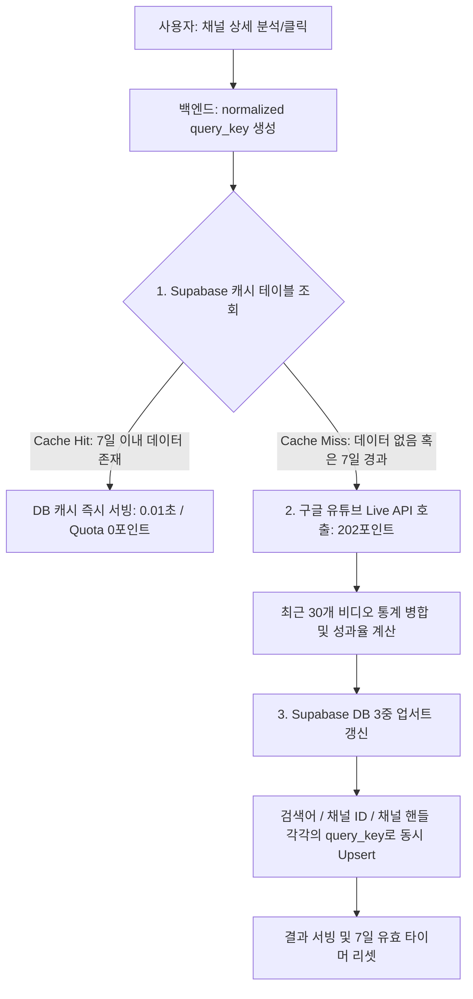

# 유튜브 채널 상세 분석 & 3중 캐시 아키텍처 가이드

본 문서는 크리에이박스(CreAibox)의 **유튜브 채널 상세 분석 및 라이벌 레이더 스캐너**의 동작 메커니즘, Supabase 데이터베이스 캐싱 설계, 구글 API 할당량(Quota) 소모 구조, 그리고 Next.js 라우팅 연동 설계에 대해 종합 기술한 엔지니어링 가이드라인입니다.

---

## 1. 개요 및 비즈니스 목적
* **목적**: 경쟁 채널 혹은 벤치마킹 타겟 채널의 구독자 대비 조회수 반응 효율을 정밀 판독하여 아웃라이어(★ 메가 히트 비디오)를 신속하게 포착하고 기획의 요인을 분석합니다.
* **최적화 필요성**: 유튜브 API는 하루 무료 제공 할당량이 타이트하게 한정되어 있으므로, 무분별한 실시간 조회를 철저히 통제하고 데이터베이스 및 브라우저 로컬 저장소와 연동되는 **하이브리드 캐싱 모델**을 통해 쿼터 소모를 99% 이상 절감하도록 구조화했습니다.

---

## 2. 하이브리드 데이터 서빙 구조

페이지 진입 및 이용 시나리오에 따라 API 호출 소모량을 극단적으로 절약합니다.

### 2.1 카테고리 탭 전환 및 메뉴 복귀 (API 호출 0회)
* 대한민국 7대 분야별 최상위 유튜버 48개씩(총 336개)의 구독자수, 누적조회수, 동영상수 등의 통계 데이터셋은 [ChannelDetail.tsx](file:///Users/a1234/Local%20Sites/creaibox/src/app/studio/youtube/%5Bsection%5D/components/ChannelDetail.tsx) 컴포넌트 내부에 정적 상수로 완전 내장되어 있습니다.
* 카테고리 탭을 변경하거나 메뉴를 나갔다 돌아올 때는 브라우저 메모리에 이미 올라와 있는 데이터를 필터링할 뿐이므로 **구글 API 호출 및 백엔드 네트워크 호출이 전혀 발생하지 않습니다 (0포인트 소모).**

### 2.2 하이브리드 아바타 서빙 (API 호출 0회)
* 채널 프로필 이미지는 구글 API를 거치지 않고 무료 캐싱 CDN인 `unavatar.io`를 통해 실시간으로 노출합니다.

### 2.3 채널 프로필 요약 카드의 메타데이터 확장
* **공식 배너 이미지 연동**: 백엔드 API 호출 시 `brandingSettings` 파트를 추가 조회하여, 채널 소유주가 등록한 고해상도 채널 아트 배너(`bannerExternalUrl`)를 분석화면 상단에 수려하게 렌더링합니다.
* **소개 스크롤 컨테이너**: 생략되던 채널의 전체 설명문을 `max-h-36 overflow-y-auto` 스크롤 뷰로 전개하여 정보 누락을 방지했습니다.
* **상세 명세 패널**: 채널 고유 ID(선택 복사 제공), 채널 개설 연월일(로컬라이징 날짜 포맷), 소속 국가 코드를 테이블 구조로 깔끔히 노출합니다.
* **태그 클라우드 파싱**: 채널이 설정해 둔 해시태그 원천 텍스트를 파싱하여 `#키워드` 형태의 세련된 라운드 뱃지 층으로 하단에 배치했습니다.

---

## 3. 유튜브 API v3 할당량 및 소모 포인트 체계

구글 유튜브 Data API v3는 단순 API 호출 횟수가 아닌 **포인트(Points) 단위**로 하루 할당량을 차감하며, API 성격에 따라 비용 차이가 극대화됩니다.

### 3.1 하루 무료 제공 기본 할당량
* **`10,000 포인트 (Points)`** / 일

### 3.2 API 함수별 포인트 소모량 명세
* **Search API (검색 - `v3/search`)**: **1회당 `100 포인트` 차감**
* **Channels API (채널 상세 - `v3/channels`)**: 1회당 **`1 포인트` 차감**
* **Videos API (비디오 상세 - `v3/videos`)**: 1회당 **`1 포인트` 차감**

### 3.3 캐시 없이 실시간 상세 분석을 수행할 때의 1회당 소모량
사용자가 특정 채널을 클릭하여 "채널 레이더"를 가동하면 아래 4단계의 쿼리가 백엔드에서 수행됩니다.
1. 채널 핸들이나 이름으로 고유 채널 ID를 획득하기 위한 검색 (`v3/search`): **100 포인트**
2. 획득한 채널 ID의 실시간 구독자/총조회수 확보 (`v3/channels`): **1 포인트**
3. 채널의 최근 30개 업로드 비디오 목록 검색 (`v3/search`): **100 포인트**
4. 30개 비디오들의 상세 조회수, 좋아요수, 댓글수 통계 벌크 로드 (`v3/videos`): **1 포인트**
* **총 1회 조회당 실질 소모량**: **`202 포인트`**

### 3.4 일일 할당량 초과 시 과금 안전장치 (Zero-Cost Quota Guard)
* **과금 불가능 정책 (GCP 기본)**:
  * 구글 클라우드 플랫폼(GCP)의 유튜브 Data API v3는 할당량 초과 시 추가 과금을 적용해 서비스를 강제 연장하는 유료 빌링 옵션 자체가 없습니다.
  * 하루 10,000포인트를 초과하는 요청에 대해서는 구글 API 서버가 자동으로 `403 Quota Exceeded` 오류 코드를 반환하며 요청을 원천 차단하므로, **유료 비용 청구의 위험이 0%로 완벽하게 안전합니다.**
* **크리에이박스 백엔드 Quota Guard**:
  * 크리에이박스 백엔드 시스템([get-free-gemini-key.ts](file:///Users/a1234/Local%20Sites/creaibox/src/lib/server/get-free-gemini-key.ts))은 데이터베이스에 누적된 호출 카운트(`today_count`)를 감시하여 한도(`daily_limit`) 도달 임박 시 백엔드 단에서 먼저 구글 API 요청을 사전에 차단합니다.
* **Vault Fallback System (오프라인 캐시 전환)**:
  * 쿼터 차단 상황이 인지되면 백엔드가 즉각 오프라인 캐시 보관소에서 준비된 Mock 데이터를 우회 응답하므로, 사용자 화면이 크래시(500) 나지 않고 안전한 가이드를 띄우도록 이중 설계되어 있습니다.

---

## 4. Supabase DB 3중 캐싱 아키텍처 및 7일 유효기간 정책

할당량 고갈을 원천 방어하기 위해 Supabase DB 캐시를 결합하여 설계를 극대화했습니다.



### 4.1 7일 캐시 유효 정책 (7-Day Lifespan Cache)
* 유튜버들의 정규 업로드 주기는 대개 일주일 내외이며, 구독자 수 및 누적 조회수 등의 채널 기본 메트릭이 며칠 사이에 급변하지 않는 점을 반영하여 캐시 유효기간을 **`7일 (168시간)`**으로 세팅했습니다.
* 7일 이내 재조회 시에는 구글 서버를 전혀 거치지 않고 DB 정보를 가동하므로 API 소모율을 **14분의 1** 수준으로 낮추었습니다.

### 4.2 3중 인덱싱 업서트 (3-Way Indexing Upsert)
* 사용자가 검색창에 한국어 이름(예: `잇섭`)으로 쳐서 들어오거나, 카드를 클릭해서 핸들(예: `@itsub`)로 들어오거나, 고유 ID(예: `UC...`)로 들어오더라도 캐시 혜택이 상시 공유되도록 **1) 입력 검색어, 2) 고유 채널 ID, 3) 채널 고유 핸들명** 세 가지 키 각각에 대해 동일한 통계 세트를 DB에 동시 덮어쓰기(Upsert)하여 캐시 적중률(Hit Rate)을 3배 이상 끌어올렸습니다.
* **덮어쓰기(Upsert) 메커니즘**:
  * 캐시가 만료되어 새로 갱신할 때는 데이터베이스 레코드가 누적 추가되어 용량을 낭비하지 않고, 해당 기본 키(`query_key`) 행 위에 최신 통계와 최신 날짜(`updated_at = NOW()`)로 **완전히 덮어씁니다.**
  * 이에 따라 채널당 상시 1행의 최신 데이터만 정갈하게 유지됩니다.

---

## 5. Next.js URL 쿼리 연동 및 브라우저 뒤로가기(Back) 해결

내부 컴포넌트의 단순 State 렌더링 전환 시 일어나는 브라우저 역사(History) 붕괴를 보완하기 위해 Next.js 라우팅 파이프라인을 이식했습니다.

* **동적 쿼리 동기화**: 채널을 클릭하거나 검색하면 URL 주소창 뒤에 `?handle=@itsub` 파라미터를 강제 동기화합니다.
* **리스너 추적**: `useSearchParams`를 통해 URL의 `handle` 값의 유무를 실시간 감지하여 상세 결과 창을 띄우거나 자동으로 소거합니다.
* **뒤로가기 & 사이드바 동작**:
  * 사용자가 뒤로가기 버튼을 누르면 URL이 원래 목록 주소인 `/studio/youtube/channel`로 바뀌므로 결과창이 닫히며 336개 벤치마크 카테고리 목록으로 자연스럽게 리셋 복원됩니다.
  * 사이드바 탭을 다시 누를 때도 URL 쿼리가 소거되어 카테고리 목록이 상시 초기 노출됩니다.
* **`ArrowLeft` 복귀 버튼**: 상세 결과창 최상단에 목록 복구 단추를 제공하여 편리성을 높였습니다.

---


## 6.5 다국가 8개국 필터링 및 글로벌 랜드마크 데이터셋
* **국가 탭 바 인터페이스**: 카테고리 필터링 바로 위에 대한민국(KR), 미국(US), 일본(JP), 영국(GB), 베트남(VN), 인도(IN), 브라질(BR), 캐나다(CA) 등 국기 이모티콘을 곁들인 8개국 가로 탭 바를 제공하여 글로벌 채널 필터가 작동합니다.
* **글로벌 랜드마크 채널**: 한국의 336개 채널 외에 미국, 일본, 캐나다 등 각 국가별 대표 유튜버(MrBeast, MKBHD, Kenshi Yonezu 등)의 정보 및 구독자, 누적조회수, 동영상수 등의 통계 세트를 내장 수록하여 연동했습니다.
* **나의 채널 비활성화 예외 처리**: 사용자가 등록하는 '나의 채널' 탭 선택 시에는 국가 탭 영역을 비활성화(Disabled) 처리하여 예외 꼬임 현상을 미연에 차단합니다.

---

## 7. 데이터베이스 테이블 스키마 DDL 및 RLS

Supabase Database SQL Editor에 실행된 테이블 명세 및 보안 정책 리포트입니다.

```sql
-- 1. 채널 통계 및 최근 비디오 아카이브용 캐시 테이블 생성
CREATE TABLE IF NOT EXISTS youtube_channel_cache (
  query_key TEXT PRIMARY KEY,
  channel_id TEXT NOT NULL,
  channel_data JSONB NOT NULL,
  videos_data JSONB NOT NULL,
  updated_at TIMESTAMP WITH TIME ZONE DEFAULT timezone('utc'::text, now()) NOT NULL
);

-- 2. 행 보안 RLS 설정 활성화
ALTER TABLE youtube_channel_cache ENABLE ROW LEVEL SECURITY;

-- 3. 누구나 조회할 수 있는 SELECT 정책 수립
CREATE POLICY "Allow public read to youtube_channel_cache" ON youtube_channel_cache
  FOR SELECT USING (true);

-- 4. 쓰기/업데이트에 대한 권한 부여 (백엔드 Route Node.js 런타임에서 upsert 수행)
CREATE POLICY "Allow write access to youtube_channel_cache" ON youtube_channel_cache
  FOR ALL USING (true) WITH CHECK (true);
```
