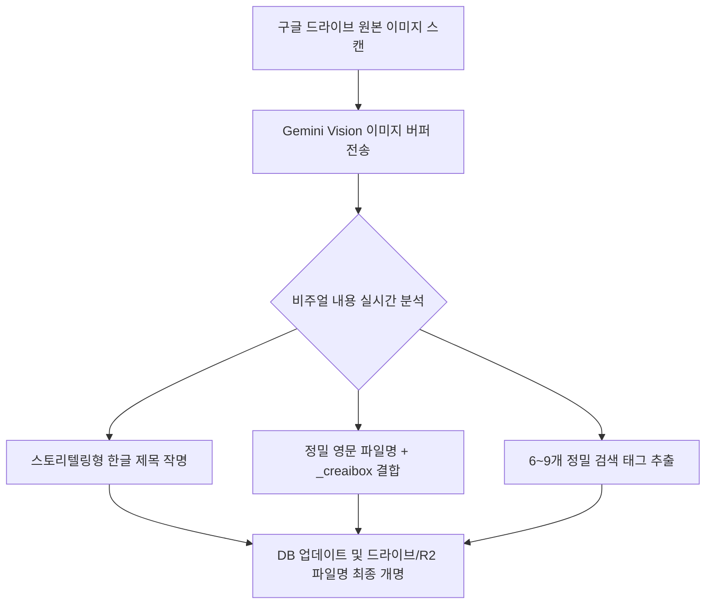

# Gemini Vision 정의 및 크리에이박스(CreAIbox) 도입 가이드

본 문서는 멀티모달 인공지능인 **Gemini Vision**의 핵심 개념과, 이를 크리에이박스(CreAIbox) 미디어 라이브러리 플랫폼에서 활용하여 자산 관리 효율성과 서비스 품질을 극대화하는 방안에 대해 서술합니다.

---

## 1. Gemini Vision 개요

**Gemini Vision**은 구글이 개발한 차세대 멀티모달(Multimodal) AI 엔진입니다. 텍스트 정보에 한정되어 학습하던 기존 AI 언어 모델과 달리, **이미지(Image), 비디오(Video), 문서(PDF/차트) 등의 시각 정보를 직접 '눈으로 보고' 분석하는 능력**을 탑재하고 있습니다.

### 핵심 역량
* **시각적 객체 및 장면 분할**: 사진이나 비디오 프레임에 나타난 주요 객체(사물, 사람, 배경)와 전체적인 상황을 식별합니다.
* **감성 및 분위기 판독**: 조명, 색조, 피사체의 표정을 바탕으로 아늑함, 몽환적, 장엄함 등 추상적인 정서와 톤(Tone)을 이해합니다.
* **텍스트와의 상호 매핑**: 시각적으로 해독한 정보를 토대로 구조화된 JSON 데이터(제목, 영문명, 태그 등)로 가공하여 프로그래밍 언어 및 데이터베이스와 직관적으로 소통합니다.

---

## 2. 크리에이박스에서의 실제 활용 (현재 구현 완료)

현재 크리에이박스의 대용량 동기화 스크립트(`test_r2_sync.ts`) 및 대청소 보정 스크립트(`refine-all-titles.ts`)에는 Gemini Vision 기술이 긴밀하게 인프라로 결합되어 있습니다.

### ① 프리미엄 한국어 작명 (Title Refinement)
* **문제 해결**: 미드저니 파일명에 묻은 `raw`, `style`, `v8` 등의 기술적 찌꺼기로 인해 기존에는 "날것 사진", "원초적 스타일" 같은 어색한 기계적 직역 제목이 등록되었습니다.
* **해결 방안**: Gemini Vision이 실제 그림을 판독하여 **"오후 햇살이 비치는 아늑한 서재"**, **"용암이 분출하는 붉은 화산 폭발"**과 같이 웹사이트 목록에 어울리는 서정적이고 고급스러운 타이틀을 단독 생성합니다.

### ② 정밀 검색 태그 자동 보강 (Tag Expansion)
* 이미지 내 주요 사물(책상, 노트북)뿐만 아니라 계절감, 시간대(일출, 석양), 지배적인 분위기(힐링, 사색, 아늑함)를 판독하여 **6~9개의 연관 검색 한글 태그**를 자동으로 주입합니다. 이로써 사용자 검색 매칭률이 극적으로 상승합니다.

### ③ 출처 브랜드 포함 영문 개명 (Branded Filename Sync)
* AI 분석 제목을 영문으로 치환 후, 플랫폼 홍보와 재방문을 유도하기 위해 파일명 맨 끝에 **`_creaibox`** 브랜드 접미사를 자동 결합합니다.
* 예: `cozy_study_space_16-9_ai_creaibox.png`
* Supabase 데이터베이스와 구글 드라이브(및 비디오의 경우 R2 스토리지 내 실물 오브젝트)의 파일명을 동시 개명해 완벽한 파일 구조 정돈을 완료합니다.

---

## 3. 크리에이박스 미래 가치 및 고도화 제안

Gemini Vision 인프라가 이미 구축되어 있으므로, 향후 비즈니스 성장 시 다음과 같은 고도의 AI 서비스를 즉시 개발하여 크리에이박스를 차별화된 프리미엄 플랫폼으로 만들 수 있습니다.

### ① 비주얼 유사 추천 서비스 (Visual Similarity Recommendation)
* 이미지의 구도, 조명 톤, 형태 정보를 학습하여, 사용자가 특정 에셋 상세 페이지를 조회할 때 하단에 **"유사한 무드의 무료 이미지들"**을 Vision 기반으로 분석해 실시간 자동 추천합니다.

### ② 자연어 의미 검색 (AI Semantic Search / Vector Search)
* 단순히 데이터베이스에 꽂힌 텍스트 태그가 일치하는지 비교하는 검색을 뛰어넘어, 사용자가 상세히 묘사하는 문장(예: *"비가 부슬부슬 내리는 창가에 머그컵이 놓여 있는 사진"*)을 검색창에 입력하면 Vision이 이미지 픽셀 정보의 숨겨진 의미를 매핑하여 완벽히 어울리는 자산을 검색해 줍니다.

### ③ 시각 장애인 및 검색최적화(SEO)를 위한 자동 설명 작성 (Alt Text Automation)
* 구글이나 네이버 등 글로벌 검색엔진 노출(SEO)을 가속화하기 위해, 이미지 상세 마크업 영역에 시각 장애인 대체 텍스트(`alt`)와 검색엔진 스크랩용 디테일 설명글을 AI가 알아서 고품질로 채워넣어 줍니다.

### ④ 지능형 비디오 대표 썸네일(Cover Image) 자동 추출
* 비디오 에셋이 등록될 때, Gemini Vision이 영상의 모든 프레임을 빠르게 판독하여 **가장 시각적 타격감이 크고 아름다운 장면(Frame)**을 자동으로 엄선·크롭하여 썸네일 대표 표지 이미지로 제작 및 설정해 줍니다.
